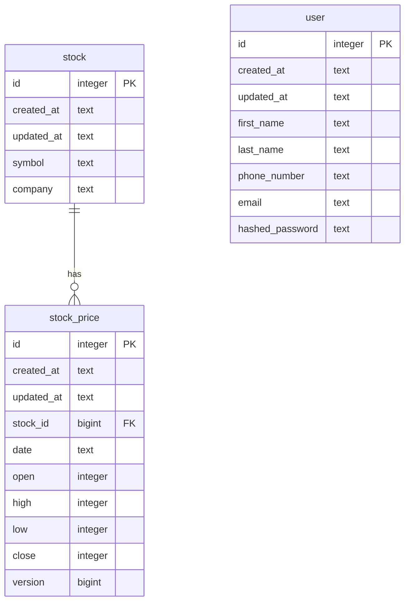

# Trade Tally
A website to help you to track your portfolio in the stock market.

### Functionalities
- Keep historic information of the stock market
- Show realtime stocks information
- Allow users to register bought stocks and keep track of the performance of their portfolio

### Database model
